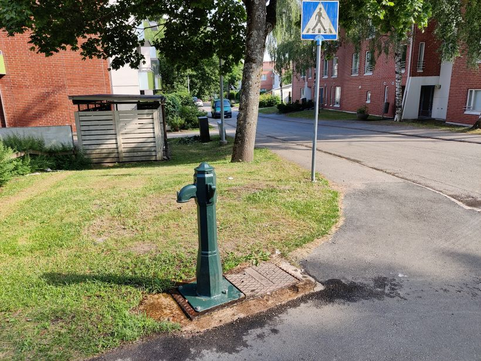
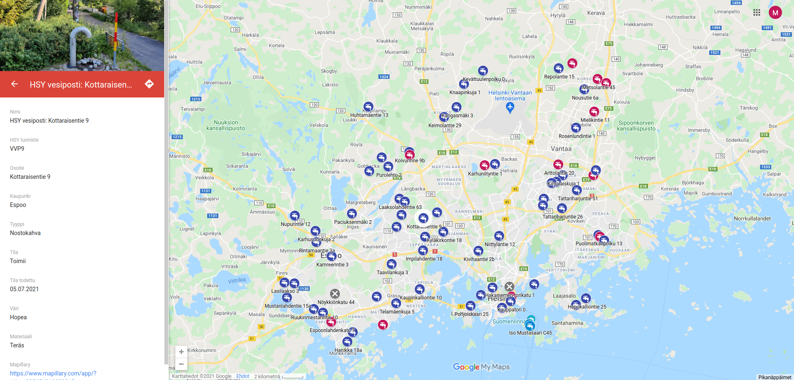

# HSY vesipostit kartalla / HSY water posts on map

<kbd></kbd> <kbd></kbd> 

## Kuvaus (in Finnish)

Tämä repo sisältää skriptejä ja tiedostoja [HSYn vesipostien](http://www.polkupyoraily.net/wiki/Vesipostit) näyttämiseen [Google Maps](https://www.google.com/maps/d/viewer?mid=1WeNhhtc9n4ypJ_X3bz5KpLppR5JNsk9A&usp=sharing) ja [OpenStreetMap](https://umap.openstreetmap.fr/en/map/hsy-vesipostit_635042#11/60.2490/24.8456) -kartoissa.
Vesipostien sijainnit perustuvat [HSYn avoimeen dataan](https://www.hsy.fi/ymparistotieto/avoindata/avoin-data---sivut/paakaupunkiseudun-vesipostit/): vesipostien sijaintidata, HSY tunniste ja osoitetiedot ovat siis peräisin [Helsingin seudun ympäristöpalvelut HSY:ltä](https://www.hsy.fi/). Google Maps ja OpenStreetMap -pohjaisissa kartoissa näkyvät vesipostien tila, tyyppi, kuvat ja lisätiedot ovat käyttäjien keräämiä, ne eivät siis tule HSY:ltä.

Tarkoitus on ylläpitää vesipostien dataa Google Maps -kartassa, jota on helpointa ylläpitää. GPX-tiedostoja ja OSM-karttaa pystyy päivittämään Google Mapsin datan pohjalta käyttämällä tämän repon skriptejä.

**Tämä repo ei ole HSYn ylläpitämä**. Palautetta kartoista voi lähettää sähköpostilla: hsy-vesipostit@polkupyoraily.net

## Description

This repositor includes scripts and files for show [HSY water posts (Finnish only)](http://www.polkupyoraily.net/wiki/Vesipostit) in [Google Maps](https://www.google.com/maps/d/viewer?mid=1WeNhhtc9n4ypJ_X3bz5KpLppR5JNsk9A&usp=sharing) and [OpenStreetMap](https://umap.openstreetmap.fr/en/map/hsy-vesipostit_635042#11/60.2490/24.8456). HSY water post locations are based on [open data provided by HSY](https://www.hsy.fi/ymparistotieto/avoindata/avoin-data---sivut/paakaupunkiseudun-vesipostit/): water post locations, HSY id and addresses come from [Helsinki Region Environmental Services HSY](https://www.hsy.fi/en/). Water post status, type, images and extra information are collected by users, so those data do not come from HSY.

The main idea is that the primary source of the data is the Google Maps based map which is easiest to update. GPX files and OSM maps can be updated from Google Maps data with the scripts from this repo.

**This repository is not maintained by HSY**. Feedback for maps can be sent by email: hsy-vesipostit@polkupyoraily.net

## Maps

* [HSY water posts in Google Maps based map](https://www.google.com/maps/d/viewer?mid=1WeNhhtc9n4ypJ_X3bz5KpLppR5JNsk9A&usp=sharing), short link: [http://www.polkupyoraily.net/hsy-vesipostit](http://www.polkupyoraily.net/hsy-vesipostit)
* [HSY water posts in OpenStreetMap based map](https://umap.openstreetmap.fr/en/map/hsy-vesipostit_635042#11/60.2490/24.8456), short link: [http://www.polkupyoraily.net/hsy-vesipostit-osm](http://www.polkupyoraily.net/hsy-vesipostit-osm)

## Water post images

Images are uploaded to Google Maps (multiple images), [Mapillary](https://www.mapillary.com/) (primary image only) and [Gifyu](https://gifyu.com/album/gMS) (multiple images). Gifyu images has advantage that you can generate image url based on the HSY id. Gifyu image urls are: `https://s6.gifyu.com/images/HSYID_1.jpg`, e.g. https://s6.gifyu.com/images/VVP1_1.jpg . If there are multiple images, image url like this might also exist `https://s6.gifyu.com/images/HSYID_2.jpg`. See all image urls from [image url doc](./image-urls.md).

## Repository usage

This repository contains following files which you might be able to import to e.g. your navigator in order to show all water posts in your device:
* [KML file](google-maps-export.kml): Exported from Google Maps
* [GPX file](google-maps-export.gpx): Converted from above KML file
* [GPX file with shorter POI names](google-maps-export-garmin-edge-800.gpx): Same as above GPX file but with shorter POI names. Intended mainly for Garmin Edge 800 which does not work well with long POI names like: "HSY vesiposti: Luuvantie 1", it will truncate these to "HSY vesiposti 1", "HSY vesiposti 2" etc. Thus use shorter POI names like: HSY: Luuvantie 1, which seems to work in Garmin Edge 800
* [OSM file](google-maps-export.osm): Converted from above KML file

## Original data

HSY original data is copied to `hsy-original-data` folder. There are two formats available:
* MapInfo TAB file `*.tab`
* ESRI Shapefile `*.shp`

Shapefile converted once to KML using tool: https://mygeodata.cloud/converter/shp-to-kml

## Development

Below instructions are written for Ubuntu Linux.

### Software needed

* [GPSBabel](http://www.gpsbabel.org/index.html)
* [Saxon-HE](https://www.saxonica.com/download/java.xml)

Install above with:
```
sudo apt install libsaxonb-java gpsbabel
```

Note that you can not use commonly used `xsltproc` since it is limited to XSLT 1.0. Saxon supports XSLT 2.0.

### Export Google Maps to KML

1. Open [HSY water posts in Google Maps based map](https://www.google.com/maps/d/viewer?mid=1WeNhhtc9n4ypJ_X3bz5KpLppR5JNsk9A&usp=sharing) in public read mode (not edit mode)
2. Click three dots from upper left corner
3. Choose load as KML (not as zipped KMZ)

### Transform KML file exported from Google Maps to OSM file

```
./kml-to-osm.sh
```

### Transform KML file exported from Google Maps to GPX file

```
./kml-to-gpx.sh
```

### Transform KML file exported from Google Maps to uMap compatible KML file

Google Maps contains field names with spaces and ä/ö/å characters which do not seem to work in uMap. Thus need to convert those field names to English ones.
Also adding `icon_symbol` field to show T/N for handle type in uMap.

```
./kml-to-umap-compatible-kml.sh
```

Import data to uMap as KML and replace layer contents. Take backup first in uMap, shape colors will reset and those need to be updated manually.

### Upload Mapillary images

Install [Mapillary tools](https://github.com/mapillary/mapillary_tools). Go to folder where new images are and execute:
```
mapillary_tools process_and_upload --import_path "./" --user_name "YOUR_MAPILLARY_USERNAME"
```

Mapillary might take a day to process images. Add link to mapillary image to Google Maps datasheet.

## Links

* [Discussion in OSM Finnish forum](https://forum.openstreetmap.org/viewtopic.php?id=73183)
* [How to use HSY water posts (in Finnish only)](http://www.polkupyoraily.net/wiki/Vesipostit)
* [JOSM plugin which can read .kml, .shp and .tab files](https://wiki.openstreetmap.org/wiki/JOSM/Plugins/OpenData)
* https://wiki.openstreetmap.org/wiki/Import/Guidelines
* https://wiki.openstreetmap.org/wiki/Import/ODbL_Compatibility

## License

**CC BY 4.0** (Creative Commons Attribution 4.0 International)

This licence was chosen since that is the licence of the original HSY data. Note that **CC BY 4.0** license is not directly compatible with OpenStreetMap which
uses ODbL license. HSY permision is pending for obtaining the necessary waivers. 

Any other code in this repository other than HSY water post GPS location and address data can be freely used by providing link to this page.
